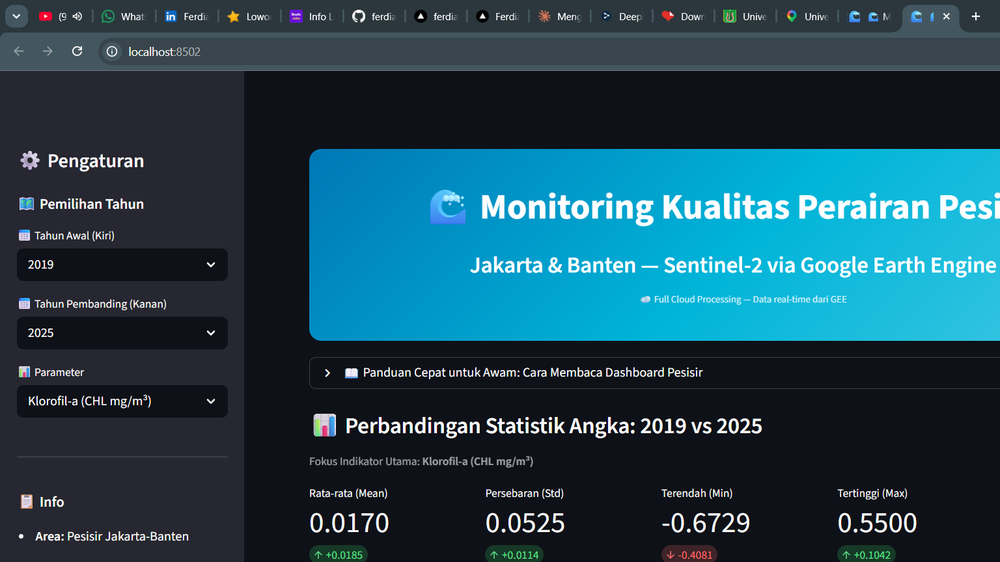

<div align="center">
  <h1>🚀 Ferdiansyach — Personal Portfolio</h1>
  
  <p><strong>Fullstack Developer (React/Next.js, Node.js) &amp; Machine Learning Enthusiast</strong></p>
  
  <p><em>Bridging the gap between scalable web engineering and data-driven intelligence.</em></p>
  
  <p>
    <a href="https://ferdiansyach-portfolio.vercel.app">View Live Website</a> • 
    <a href="https://ferdiansyach-portfolio.vercel.app/portfolio-pdf">Download CV (ATS-Friendly)</a> • 
    <a href="https://ferdiansyach-portfolio.vercel.app/projects-pdf">View Project Portfolio</a>
  </p>

  <br />

  <p>
    <a href="https://nextjs.org/"></a>
    <a href="https://www.typescriptlang.org/"></a>
    <a href="https://tailwindcss.com/"></a>
    <a href="https://www.framer.com/motion/"></a>
  </p>
</div>

---

## 👨‍💻 About This Project

This repository contains the source code for my personal portfolio website. Built from scratch using modern web technologies, it serves as a central hub to showcase my professional path, technical skills, and selected projects. 

The application is engineered with a focus on **high performance**, **seamless user experience (UX)**, and **ATS-optimized print layouts** so that recruiters can download a perfectly-formatted 1-page CV directly from the site.

---

## 📸 Projects Showcase

Here are the featured projects that define my technical capabilities:

### 🛍️ Indosaji E-commerce
*Full-stack MERN (MongoDB, Express, React, Node.js) web application with secure payments.*
* **Visual:**
  
* **Key Achievements:**
  * Integrated **Stripe API** for secure, real-time transaction processing.
  * Implemented React Context API for clean global state management (auth and shopping cart).
  * Designed robust RESTful APIs with secure admin/user role separation using JWT.

### 🤖 Smart Meter Anomaly Detection & Forecasting
*Predictive AI models (LSTM & XGBoost) and interactive analytics dashboard.*
* **Visual:**
  
* **Key Achievements:**
  * Built predictive LSTM + XGBoost models achieving **92% accuracy** in energy forecasting at Telkom Indonesia.
  * Structured end-to-end data pipeline processing **50,000+ data points**.
  * Developed a real-time Streamlit dashboard adopted by the techno-economic analysis team.

### 🌊 Coastal Water Quality Monitoring (Web-GIS)
*Temporal coastal water quality monitoring via Google Earth Engine (2019-2025).*
* **Visual:**
  
* **Key Achievements:**
  * Automated cloud masking and processing of multi-sensor data (Sentinel-2 & Landsat-8).
  * Implemented **K-Means clustering** for spatial zoning and **Mann-Kendall** tests for trend analysis.
  * Designed an interactive Streamlit dashboard mapping spatial water quality distribution.

---

## ✨ Key Features of the Portfolio Website

- **🌐 Bilingual (i18n):** Instant translation toggle between Indonesian (ID) and English (EN) using client-side state.
- **🌙 Theme Toggle:** Full Dark Mode and Light Mode capability using Tailwind variables.
- **📄 ATS-friendly CV Export:** Specialized `/portfolio-pdf` and `/projects-pdf` routes built with precise CSS media query rules `@media print` to render as clean, professional A4 printouts.
- **⚡ Performance First:** Achieves **Lighthouse scores of 90+** via static generation, component optimization, and lightweight animations.
- **📱 Fully Responsive:** Adaptive layouts supporting all devices from 320px mobile viewports to ultra-wide monitors.

---

## 🛠️ Tech Stack & Tools

- **Framework:** Next.js (App Router)
- **Programming Language:** TypeScript
- **Styling:** Tailwind CSS (with custom themes)
- **Animations:** Framer Motion (page transitions, scroll events, 3D hover effects)
- **Linting & Quality:** ESLint, Prettier
- **Hosting:** Vercel

---

## 🚀 Getting Started (Local Development)

To run this project locally, execute the following commands in your terminal:

1. **Clone the repository:**
   ```bash
   git clone https://github.com/ferdiansyach/ferdiansyach-portfolio.git
   ```

2. **Navigate to the directory:**
   ```bash
   cd ferdiansyach-portfolio
   ```

3. **Install dependencies:**
   ```bash
   npm install
   ```

4. **Run the development server:**
   ```bash
   npm run dev
   ```

5. Open [http://localhost:3000](http://localhost:3000) in your browser to see the live site.

---

## 📬 Let's Connect

I am always open to discussing web engineering projects, data analytics initiatives, or potential collaboration opportunities. Feel free to reach out!

- **Email:** [iyanferdiansyach30@gmail.com](mailto:iyanferdiansyach30@gmail.com)
- **LinkedIn:** [linkedin.com/in/ferdiansyach](https://www.linkedin.com/in/ferdiansyach-845930246/)
- **GitHub:** [github.com/ferdiansyach](https://github.com/ferdiansyach)
- **WhatsApp:** [+62 888 6007 599](https://wa.me/628886007599)

---

<div align="center">
  <i>Designed & Developed with ❤️ by Ferdiansyach © 2026</i>
</div>
