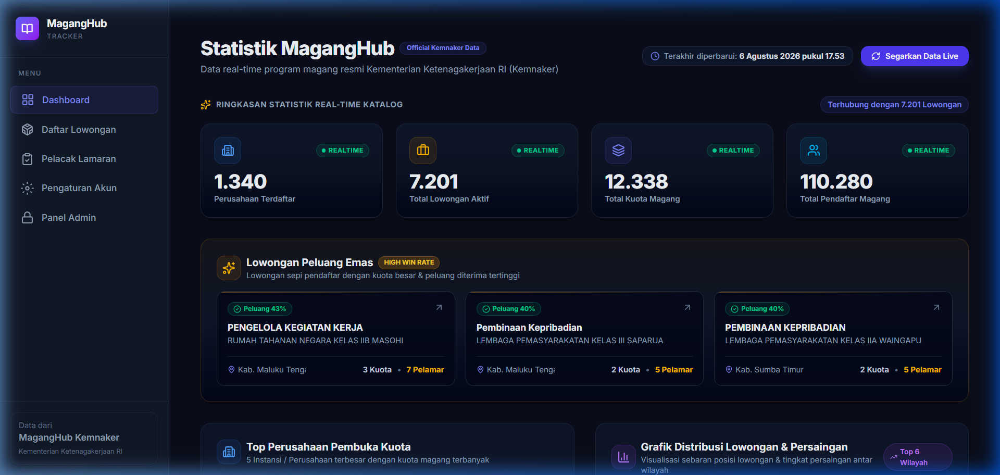
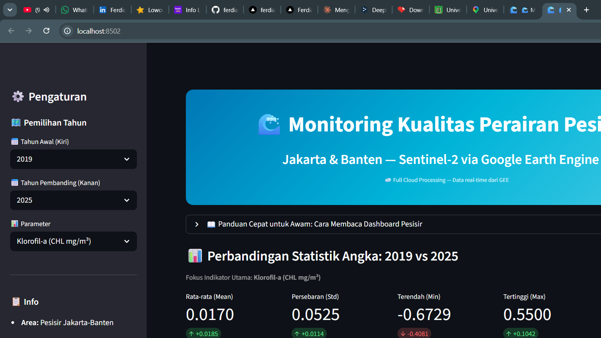
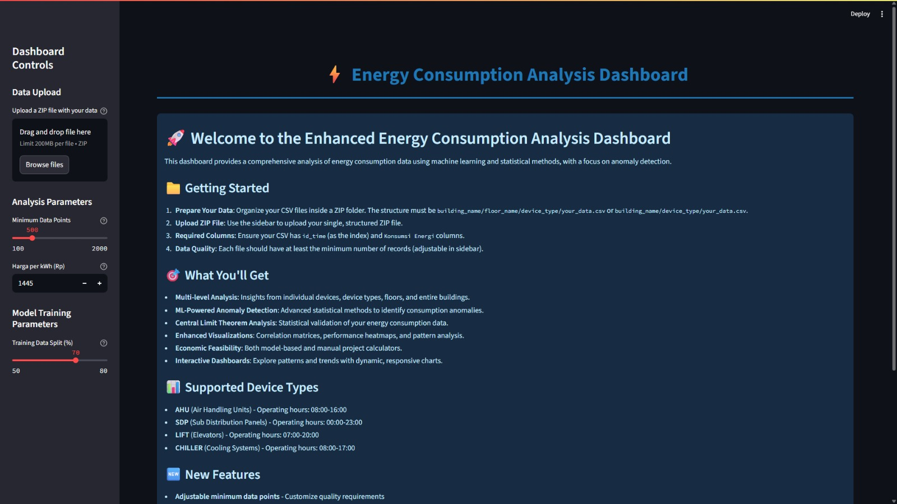
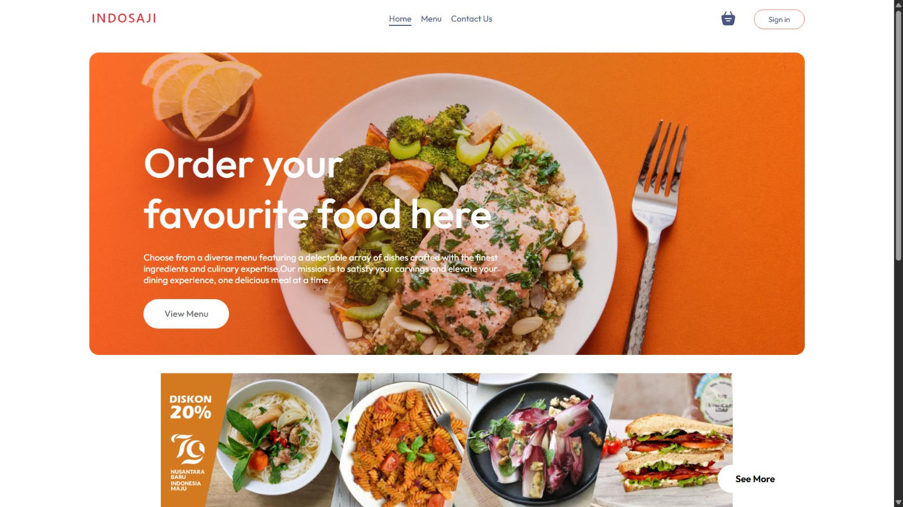

<div align="center">
  <h1>🚀 Ferdiansyach — Personal Portfolio</h1>
  
  <p><strong>Fullstack Developer (React/Next.js, Go) · Data Analyst · AI/ML Engineer</strong></p>
  
  <p><em>Bridging scalable web engineering, data intelligence, and computer vision — fresh graduate from Universitas Nasional, Jakarta.</em></p>
  
  <p>
    <a href="https://ferdiansyach-portfolio.vercel.app">🌐 Live Website</a> •
  </p>

  <br />

  <p>
    <a href="https://nextjs.org/"></a>
    <a href="https://react.dev/"></a>
    <a href="https://www.typescriptlang.org/"></a>
    <a href="https://tailwindcss.com/"></a>
    <a href="https://www.framer.com/motion/"></a>
    <a href="https://vercel.com/"></a>
  </p>
</div>

---

## 👨‍💻 About This Project

This repository contains the source code for my personal portfolio website, built from scratch with the latest modern web technologies. It serves as a central hub to showcase my professional path, technical skills, and selected real-world projects.

The site is engineered for **high performance**, **seamless bilingual UX** (Indonesian & English), and **ATS-optimized print layouts** — so that recruiters can download a perfectly formatted CV directly from the site, or request a Word (`.docx`) export.

---

## ✨ Key Features

| Feature | Details |
|---|---|
| 🌐 **Bilingual (i18n)** | Instant toggle between Indonesian (ID) and English (EN) via client-side state — no page reload |
| 🌙 **Dark / Light Mode** | Full theme toggle using CSS variables and `useSyncExternalStore` backed by `localStorage` |
| ⚡ **Performance First** | Lighthouse 90+ via static generation, Turbopack dev server, and optimized component tree |
| 📱 **Fully Responsive** | Adaptive layouts from 320px mobile to ultra-wide monitors |
| 🎨 **Premium UI & Animations** | CursorGlow, PageLoader, Shader background animations (GLSL via `@paper-design/shaders-react`), TiltCard, SpotlightCard, MagneticButton, VerticalCutReveal, TracingBeam |
| 🔍 **SEO + JSON-LD** | Full `<meta>`, Open Graph, Twitter Card, and Schema.org `Person` structured data |
| 🎓 **Certifications Section** | Displays professional certifications with credential links and images |
| 💬 **Testimonials Section** | Social proof section from peers and supervisors |

---

## 📸 Projects Showcase

The portfolio features **10 real-world projects** ordered from newest to oldest across full-stack web, data science, machine learning, and AI/computer vision:

### 📊 MagangTracking Platform *(2026)*
*Internship tracker & analytics platform for MagangHub Kemnaker.*
- Decoupled fullstack architecture: **Go (Gin)** backend + **Next.js 16** frontend + **Supabase PostgreSQL**.
- Token-based authentication (CORS) and real-time analytics dashboard for 100+ interns.
- Live: [magangtracking.vercel.app](https://magangtracking.vercel.app)



---

### 🌊 Coastal Water Quality Monitoring (Web-GIS) *(2026)*
*Temporal coastal water quality monitoring via Google Earth Engine (2019–2025), Jakarta & Banten.*
- Automated cloud masking and multi-sensor processing (Sentinel-2 & Landsat-8).
- Implemented **K-Means clustering** for spatial zoning & **Mann-Kendall** tests for trend analysis.
- Designed an interactive Streamlit dashboard mapping spatial water quality distribution.



---

### ♻️ Waste Classification AI App *(2025)*
*AI-powered fullstack web app — upload a photo, get instant waste category & handling recommendations.*
- Built with **Next.js 15 App Router**, **Gemini Vision API**, **PostgreSQL**, and **Drizzle ORM**.
- Implemented prompt engineering for structured AI output (category + handling recommendations).
- Fully deployed on Vercel: [waste-classification-rust.vercel.app](https://waste-classification-rust.vercel.app)

---

### 🤖 Smart Meter Anomaly Detection & Forecasting *(2025 — Telkom Indonesia Internship)*
*Predictive AI (LSTM & XGBoost) and interactive analytics dashboard.*
- Built LSTM + XGBoost predictive models achieving **92% accuracy** in energy forecasting.
- Designed an end-to-end data pipeline processing **50,000+ data points**.
- Developed a real-time Streamlit dashboard adopted by the techno-economic analysis team.



---

### 🗑️ AI Waste Detection System *(2024–2025 — PKM × DLHK Depok)*
*Real-time YOLOv11 object detection — community service collaboration with DLHK Kota Depok.*
- Trained on **10,000+ annotated images** across 6 waste categories.
- Achieved **mAP 97.5% (IoU 0.5)**, Precision 96.2%, Recall 95.8%.
- Deployed AI waste classification web platform + technology transfer training in the field.

---

### 🏛️ HIMASI UNAS Website *(2024–2025)*
*Official WordPress CMS site for the student association.*
- Increased website traffic by 40% via structured, SEO-optimized content.

---

### 🛍️ Indosaji E-commerce *(2024)*
*Full-stack MERN (MongoDB, Express, React, Node.js) web application with Stripe payment gateway.*
- Integrated **Stripe API** for secure, real-time transaction processing.
- Implemented React Context API for global state management (auth & shopping cart).
- Designed robust RESTful APIs with secure admin/user role separation via JWT.



---

### 🌐 Website UNAS FEST *(2024)*
*Official large-scale portal for the annual Universitas Nasional festival.*
- Built 10+ responsive components with TypeScript & Tailwind CSS (Lighthouse 90+).
- Engineered Jest + RTL testing pipeline, reducing production bug rate by 60%.

---

### 🌿 RTH Monitoring (U-Net & Sentinel-2) *(2024)*
*Deep learning urban green space change detection in DKI Jakarta (2019 vs 2023).*
- U-Net semantic segmentation of Sentinel-2 multi-spectral satellite imagery.
- Interactive Streamlit dashboard for spatial segmentation maps and vegetation area statistics.

---

### 📈 Sentiment Analysis Dashboard *(2024)*
*Interactive NLP dashboard for text sentiment classification.*
- TF-IDF feature extraction, stopword removal, stemming/lemmatization pipeline.
- Visualization: WordCloud, sentiment distribution charts.

---

## 🛠️ Tech Stack

### Web Development
| Layer | Technologies |
|---|---|
| **Framework** | Next.js 16 (App Router) · React 19 |
| **Language** | TypeScript 5 |
| **Styling** | Tailwind CSS v4 (CSS-first config, `@tailwindcss/postcss`) |
| **Animations** | Framer Motion 12 · `@paper-design/shaders-react` (GLSL shaders) · Three.js |
| **Icons** | Lucide React · React Icons |
| **Backend (project)** | Go (Gin) · Node.js · Express.js |
| **Databases** | PostgreSQL · MongoDB · Supabase · Drizzle ORM |
| **Auth** | JWT |

### Data Science & AI/ML
| Domain | Technologies |
|---|---|
| **Languages** | Python · R |
| **ML/DL** | XGBoost · LSTM (Keras) · YOLOv11 · U-Net · PyTorch · Scikit-learn |
| **Data** | Pandas · NumPy · Matplotlib |
| **NLP** | NLTK · TF-IDF |
| **GIS / Remote Sensing** | Google Earth Engine · Sentinel-2 · Landsat-8 · QGIS |
| **Dashboards** | Streamlit · Tableau |
| **AI APIs** | Gemini Vision API (Google AI) |

### DevOps & Tools
| Category | Technologies |
|---|---|
| **Hosting** | Vercel |
| **CI/CD** | GitHub Actions |
| **Testing** | Jest · React Testing Library · Vitest |
| **Version Control** | Git · GitHub |
| **Design** | Figma |
| **Cloud** | Google Cloud Platform |

---

## 🏗️ Project Architecture

```
src/
├── app/                        # Next.js App Router
│   ├── page.tsx                # Main SPA (client-rendered)
│   ├── layout.tsx              # Root layout (Inter + Lora fonts, SEO, JSON-LD)
│   ├── globals.css             # Design tokens (CSS variables, Reflect.app system)
│   ├── portfolio-pdf/          # ATS-friendly CV export (4 roles x 2 languages)
│   ├── projects-pdf/           # Visual project portfolio PDF
│   └── projects/[slug]/        # Dynamic project detail pages
├── components/
│   ├── sections/               # Page sections
│   │   ├── HeroSection.tsx     # Landing with shader animation
│   │   ├── AboutSection.tsx
│   │   ├── StatsSection.tsx
│   │   ├── SkillsSection.tsx
│   │   ├── ProjectsSection.tsx
│   │   ├── ExperienceSection.tsx
│   │   ├── EducationSection.tsx
│   │   ├── CertificationsSection.tsx
│   │   └── ContactSection.tsx
│   ├── ui/                     # Reusable UI primitives
│   │   ├── GlassCard.tsx
│   │   ├── TiltCard.tsx
│   │   ├── SpotlightCard.tsx
│   │   ├── MagneticButton.tsx
│   │   ├── AnimatedSection.tsx
│   │   ├── CursorGlow.tsx
│   │   ├── PageLoader.tsx
│   │   ├── ProjectDialog.tsx
│   │   ├── TracingBeam.tsx
│   │   ├── VerticalCutReveal.tsx
│   │   ├── shader-animation.tsx
│   │   └── ...
│   └── layout/                 # Navbar, Footer, ScrollToTop
├── data/                       # Content data (bilingual id/en)
│   ├── projects.ts             # 10 projects catalog
│   ├── skills.ts               # Skill categories & proficiency
│   ├── experience.ts           # Work experience & education
│   ├── certifications.ts       # Professional certifications
│   ├── testimonials.ts
│   └── translations.ts         # Global UI strings
├── hooks/                      # useTheme, useLanguage, useReducedMotion, cn
└── types/index.ts              # Shared TypeScript interfaces
```

---

## 🎓 Education & Certifications

**Universitas Nasional, Jakarta** — S.Kom Sistem Informasi (2022–2026) · GPA 3.77/4.00

| Certification | Issuer | Year |
|---|---|---|
| 🏅 Junior Web Developer (BNSP) | BNSP — National Professional Certification Board | Feb 2026 |
| 📜 IEEE Conference Paper (1st Author) — XGBoost Energy Forecasting & Spatial Mapping | IEEE / ICETISI 2025 | Dec 2025 |
| 🐍 IT Specialist \| Python | Certiport (Pearson VUE) | Oct 2025 |
| 🔄 Scrum Mastery | Telkom Indonesia | Jul 2025 |
| 📡 Internet of Things Fundamental | Telkom Indonesia | Apr 2025 |
| ☁️ Google Cloud Computing Foundations | Google Cloud | Dec 2024 |
| 📊 Statistics Using R for Data Science | DQLab | Feb 2023 |

---

## 💼 Work Experience

| Role | Company | Period |
|---|---|---|
| Business Intelligence & ML Intern | Telkom Indonesia \| Infranexia | Apr 2025 – Sep 2025 |
| Computer Lab Assistant | Lab Data Monetize \| Universitas Nasional | Sep 2024 – Sep 2025 |
| Fullstack Developer | UNAS FEST \| Universitas Nasional Festival | Apr 2024 – Mar 2025 |
| Research & Development Member (PKM) | PKM Pengabdian Masyarakat \| Universitas Nasional | Jun 2024 – Mar 2025 |
| Research & Development Assistant | HIMASI \| Universitas Nasional | Jun 2024 – Mar 2025 |

---

## 🚀 Getting Started (Local Development)

```bash
# 1. Clone the repository
git clone https://github.com/ferdiansyach/ferdiansyach-portfolio.git
cd ferdiansyach-portfolio

# 2. Install dependencies
npm install

# 3. Run the development server (Turbopack)
npm run dev
```

Open [http://localhost:3000](http://localhost:3000) to view the site locally.

### Available Scripts

```bash
npm run dev        # Dev server with Turbopack
npm run build      # Production build
npm run lint       # ESLint (next/core-web-vitals + TypeScript)
npm run test       # Vitest (watch mode)
npm run test:run   # Vitest single run
```

---

## 📬 Let's Connect

I'm always open to discussing web engineering projects, data analytics initiatives, AI/ML collaborations, or job opportunities. Feel free to reach out!

| Channel | Link |
|---|---|
| 📧 Email | [iyanferdiansyach30@gmail.com](mailto:iyanferdiansyach30@gmail.com) |
| 💼 LinkedIn | [linkedin.com/in/ferdiansyach](https://www.linkedin.com/in/ferdiansyach-845930246/) |
| 🐙 GitHub | [github.com/ferdiansyach](https://github.com/ferdiansyach) |
| 💬 WhatsApp | [+62 888 6007 599](https://wa.me/628886007599) |
| 🌐 Portfolio | [ferdiansyach-portfolio.vercel.app](https://ferdiansyach-portfolio.vercel.app) |

---

<div align="center">
  <i>Designed & Developed with ❤️ by Ferdiansyach © 2026</i>
</div>
