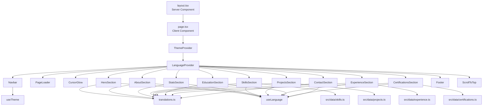

# PRD: Ferdiansyach Personal Portfolio Website

> **Document Version:** 1.0
> **Last Updated:** 2026-07-28
> **Status:** Active
> **Deployed URL:** [ferdiansyach-portfolio.vercel.app](https://ferdiansyach-portfolio.vercel.app)

---

## 1. Overview

### 1.1 Product Summary

A professional personal portfolio website for **Ferdiansyach**, a Fresh Graduate in Information Systems from Universitas Nasional. The site showcases his skills as a Fullstack Developer & Data Analyst, featuring projects, work experience, education, certifications, and a contact form. It is a bilingual (Indonesian/English) single-page application with dynamic project detail pages.

### 1.2 Goals & Objectives

| Goal | Metric |
|------|--------|
| Showcase professional portfolio | All sections render correctly with rich UI |
| Bilingual support (ID/EN) | Every user-facing string has `{ id, en }` translations |
| Premium, modern aesthetics | Reflect.app-inspired design system with glassmorphism, animations |
| Performance & SEO | Lighthouse 90+ scores, proper meta tags, JSON-LD |
| ATS-friendly CV export | PDF routes for CV and project portfolio |
| Accessibility | Reduced-motion support, focus-visible rings, semantic HTML |

### 1.3 Target Users

- **Recruiters & Hiring Managers** — evaluating Ferdiansyach's portfolio
- **Potential Clients** — seeking freelance development services
- **Peers & Collaborators** — exploring technical projects

---

## 2. Tech Stack

| Layer | Technology | Version | Notes |
|-------|-----------|---------|-------|
| Framework | Next.js (App Router) | 16.2.2 | Turbopack enabled for dev |
| UI Library | React | 19.2.4 | React 19 features |
| Language | TypeScript | ^5 | Strict mode enabled |
| Styling | Tailwind CSS | ^4 | v4 with `@tailwindcss/postcss` plugin |
| Animations | Framer Motion | ^12.38.0 | Page transitions, scroll reveals |
| Icons | React Icons | ^5.6.0 | Icon library |
| Utility | clsx + tailwind-merge | ^2.1.1 / ^3.6.0 | `cn()` utility in `src/hooks/cn.ts` |
| Testing | Vitest | ^4.1.7 | No test files exist yet |
| Testing Utils | @testing-library/react | ^16.3.2 | With jsdom |
| Deploy | Vercel | — | Auto-deploy from Git |

### 2.1 Key Configuration Files

| File | Purpose |
|------|---------|
| `next.config.ts` | Turbopack root, allowed dev origins |
| `tsconfig.json` | `@/*` path alias → `./src/*`, target ES2017 |
| `postcss.config.mjs` | `@tailwindcss/postcss` plugin (Tailwind v4 setup) |
| `eslint.config.mjs` | `next/core-web-vitals` + TypeScript rules |
| `package.json` | Scripts: `dev`, `build`, `lint`, `test`, `test:run` |

### 2.2 Commands

```bash
npm run dev          # Dev server (Turbopack enabled)
npm run build        # Production build
npm run lint         # ESLint
npm run test         # Vitest (watch mode — no tests exist yet)
npm run test:run     # Vitest single run
```

---

## 3. Architecture & File Structure

### 3.1 Directory Map

```
src/
├── app/                          # Next.js App Router
│   ├── layout.tsx                # Root layout (fonts, SEO metadata, JSON-LD)
│   ├── page.tsx                  # Main SPA — client component, renders all sections
│   ├── globals.css               # Design tokens, base styles, Tailwind imports
│   ├── favicon.ico
│   ├── opengraph-image.jpg       # OG image
│   ├── twitter-image.jpg         # Twitter card image
│   ├── portfolio-pdf/            # ATS-friendly CV export route
│   ├── projects/[slug]/page.tsx  # Dynamic project detail pages
│   └── projects-pdf/             # Project portfolio PDF (uses  intentionally)
│
├── components/
│   ├── layout/                   # Structural components
│   │   ├── Navbar.tsx            # Navigation bar with theme/lang toggle
│   │   ├── Footer.tsx            # Site footer
│   │   └── ScrollToTop.tsx       # Scroll-to-top FAB
│   │
│   ├── sections/                 # Page sections (ordered as rendered)
│   │   ├── HeroSection.tsx       # Hero with typewriter, floating badges
│   │   ├── AboutSection.tsx      # "Why Me?" cards
│   │   ├── StatsSection.tsx      # Animated statistics counters
│   │   ├── SkillsSection.tsx     # Categorized tech stack grid
│   │   ├── ProjectsSection.tsx   # Project cards with category filter
│   │   ├── ExperienceSection.tsx # Work experience timeline
│   │   ├── EducationSection.tsx  # Academic background
│   │   ├── CertificationsSection.tsx  # Licenses & certs with filter
│   │   ├── ContactSection.tsx    # Contact form + social links
│   │   └── TestimonialsSection.tsx # (imported in data, not in page.tsx currently)
│   │
│   └── ui/                       # Reusable UI primitives
│       ├── AnimatedSection.tsx   # Scroll-triggered animation wrapper
│       ├── CursorGlow.tsx        # Cursor-following glow effect
│       ├── DecryptedText.tsx     # Text decryption animation
│       ├── GlassCard.tsx         # Glassmorphism card component
│       ├── GridBackground.tsx    # Grid pattern background
│       ├── MagneticButton.tsx    # Magnetic hover button effect
│       ├── Meteors.tsx           # Meteor shower animation
│       ├── PageLoader.tsx        # Initial page loading animation
│       ├── ParticleBackground.tsx # Floating particle system
│       ├── ProjectDialog.tsx     # Project detail modal/dialog
│       ├── ScrollProgress.tsx    # Scroll progress indicator bar
│       ├── SectionHeader.tsx     # Consistent section heading
│       ├── SkillIcon.tsx         # SVG icons for tech skills (28KB — large file)
│       ├── SpotlightCard.tsx     # Spotlight hover effect card
│       ├── StatusBadge.tsx       # Status indicator badge
│       ├── TiltCard.tsx          # 3D tilt effect card
│       └── TracingBeam.tsx       # Scroll-tracing beam animation
│
├── data/                         # Content data (all bilingual)
│   ├── projects.ts               # Project entries (slug, description, images, tech)
│   ├── skills.ts                 # SkillCategory[] with proficiency levels
│   ├── experience.ts             # Work experience entries
│   ├── certifications.ts         # Certification entries
│   ├── testimonials.ts           # Testimonial quotes
│   └── translations.ts           # UI string translations (nav, hero, contact, etc.)
│
├── hooks/                        # Custom React hooks
│   ├── cn.ts                     # clsx + tailwind-merge utility
│   ├── useLanguage.tsx           # Language context (id/en), useSyncExternalStore
│   ├── useTheme.tsx              # Theme context (dark/light), useSyncExternalStore
│   ├── useReducedMotion.tsx      # Reduced-motion media query hook
│   └── useScrollReveal.tsx       # Intersection Observer scroll reveal
│
└── types/
    └── index.ts                  # Shared TypeScript interfaces
```

### 3.2 Rendering Strategy

| Route | Rendering | Notes |
|-------|-----------|-------|
| `/` (page.tsx) | **Client-side** (`"use client"`) | Wraps all sections in Theme/Language providers |
| `/projects/[slug]` | **Client-side** | Dynamic project detail pages |
| `/portfolio-pdf` | **Server/Client** | Blocked in production via `NODE_ENV` check |
| `/projects-pdf` | **Client** | Uses raw `` for print compat (ESLint rule disabled) |
| `layout.tsx` | **Server component** | SEO metadata, fonts, JSON-LD |

---

## 4. Design System (Reflect.app Inspired)

### 4.1 CSS Custom Properties

All design tokens are defined as CSS custom properties in `src/app/globals.css`. **Always use `var(--color-*)` references — never hardcode hex values.**

#### Colors — Dark Mode (Default)

| Token | Value | Usage |
|-------|-------|-------|
| `--color-canvas` | `#121214` | Page background |
| `--color-canvas-elevated` | `#1a1a1e` | Card/surface background |
| `--color-ink` | `#e3e3e6` | Primary text |
| `--color-body` | `#a0a0a5` | Body text |
| `--color-muted` | `#707075` | Muted/secondary text |
| `--color-primary` | `#7c3aed` | Violet accent (brand) |
| `--color-primary-hover` | `#6d28d9` | Hover state |
| `--color-primary-active` | `#5b21b6` | Active/pressed state |
| `--color-on-primary` | `#ffffff` | Text on primary bg |
| `--color-hairline` | `#2a2a2e` | Borders/dividers |
| `--color-semantic-info` | `#3b82f6` | Info blue |
| `--color-semantic-success` | `#16a34a` | Success green |
| `--color-semantic-warning` | `#ea580c` | Warning orange |

#### Colors — Light Mode (`.light` class on `<html>`)

| Token | Override Value |
|-------|---------------|
| `--color-canvas` | `#faf9f6` |
| `--color-canvas-elevated` | `#ffffff` |
| `--color-ink` | `#1a1a1c` |
| `--color-body` | `#4a4a4e` |
| `--color-muted` | `#6b6b70` |
| `--color-hairline` | `#e6e4df` |

#### Spacing Scale

| Token | Value |
|-------|-------|
| `--spacing-xxxs` | 4px |
| `--spacing-xxs` | 8px |
| `--spacing-xs` | 12px |
| `--spacing-sm` | 16px |
| `--spacing-md` | 24px |
| `--spacing-lg` | 32px |
| `--spacing-xl` | 48px |
| `--spacing-xxl` | 64px |
| `--spacing-super` | 96px |

### 4.2 Typography

| Usage | Font | CSS Variable | Tailwind Class |
|-------|------|-------------|----------------|
| Headings & Titles | Lora (serif) | `--font-lora` | `font-serif` |
| Body & Controls | Inter (sans) | `--font-inter` | `font-sans` |

Both fonts are loaded via `next/font/google` in `layout.tsx` with `display: "swap"`.

### 4.3 Utility Classes (globals.css)

| Class | Purpose |
|-------|---------|
| `glass-card` | Pre-styled card: elevated bg + hairline border + 12px radius + soft shadow + hover border-color transition |
| `hero-badge` | Floating badge: elevated bg + hairline border + 8px radius |
| `section-divider` | 1px horizontal line divider, max-width 120px, centered |

### 4.4 Theme Mechanism

- **Dark mode is the default** — `<html>` starts with class `dark`
- Theme toggle adds/removes `dark`/`light` class on `<html>`
- Light mode overrides are scoped under `.light { ... }` in `globals.css`
- State persisted in `localStorage` key `"theme"`
- Managed by `useTheme()` hook via `useSyncExternalStore`

---

## 5. Internationalization (i18n)

### 5.1 Architecture

All user-facing text uses the `TranslatedText` type:

```typescript
interface TranslatedText {
  id: string;  // Indonesian
  en: string;  // English
}
```

### 5.2 Translation System

| Component | File |
|-----------|------|
| UI strings (nav, buttons, labels) | `src/data/translations.ts` |
| Content strings (descriptions, bullets) | Inline in `src/data/*.ts` files |
| Language hook | `src/hooks/useLanguage.tsx` |

### 5.3 Usage Pattern

```tsx
const { t, lang, toggleLang } = useLanguage();

// For TranslatedText objects:
<p>{t(translations.hero.description)}</p>

// The t() function simply selects obj[lang]
```

### 5.4 Rules

- **NEVER hardcode display strings** — always use `{ id: "...", en: "..." }` objects
- Default language is `"id"` (Indonesian)
- State persisted in `localStorage` key `"lang"`
- Server snapshot returns `"id"` to avoid hydration mismatch

---

## 6. TypeScript Interfaces

Defined in `src/types/index.ts`:

| Interface | Key Fields |
|-----------|-----------|
| `TranslatedText` | `{ id: string; en: string }` |
| `Project` | `slug`, `title`, `description`, `longDescription`, `challenges`, `technologies[]`, `category` ("webdev" \| "datascience" \| "wordpress"), `thumbnail`, `images[]`, `githubUrl?`, `liveUrl?`, `period?`, `pdfBullets?` |
| `Experience` | `id`, `role`, `company`, `type?`, `location?`, `period`, `isCurrent?`, `bullets[]` |
| `Skill` | `name`, `icon`, `color`, `proficiency` ("beginner" \| "intermediate" \| "advanced"), `isLearning?`, `usageContext?` |
| `SkillCategory` | `title`, `skills[]` |
| `Education` | `institution`, `degree`, `period`, `gpa?`, `thesis?`, `courses?` |
| `Certification` | `id`, `name`, `issuer`, `date`, `credentialUrl?`, `category` ("technical" \| "cloud" \| "methodology" \| "data"), `badge?`, `image?` |
| `Testimonial` | `id`, `quote`, `name`, `role`, `company`, `avatar?` |
| `Language` | `"id" \| "en"` |
| `Theme` | `"dark" \| "light"` |

---

## 7. State Management

No external state library (Redux/Zustand). State is managed through:

| State | Mechanism | Persistence |
|-------|-----------|-------------|
| Theme (dark/light) | `useSyncExternalStore` + Context | `localStorage("theme")` |
| Language (id/en) | `useSyncExternalStore` + Context | `localStorage("lang")` |
| Scroll position | Native browser | — |
| Form state | Local React state | — |
| Filter state (projects, certs) | Local React state | — |

### 7.1 Provider Hierarchy

```tsx
<ThemeProvider>
  <LanguageProvider>
    {/* All sections and layout components */}
  </LanguageProvider>
</ThemeProvider>
```

Both providers MUST wrap any component using `useTheme()` or `useLanguage()`.

---

## 8. Page Sections (Render Order)

The main page (`src/app/page.tsx`) renders sections in this exact order, separated by `<div className="section-divider" />`:

| # | Section | Component | Anchor ID |
|---|---------|-----------|-----------|
| 1 | Hero | `HeroSection` | `#hero` (top) |
| 2 | About | `AboutSection` | `#about` |
| 3 | Stats | `StatsSection` | — |
| 4 | Skills | `SkillsSection` | `#skills` |
| 5 | Projects | `ProjectsSection` | `#projects` |
| 6 | Experience | `ExperienceSection` | `#experience` |
| 7 | Education | `EducationSection` | `#education` |
| 8 | Certifications | `CertificationsSection` | `#certifications` |
| 9 | Contact | `ContactSection` | `#contact` |

> **Note:** `TestimonialsSection` exists in components and data but is **NOT currently rendered** in `page.tsx`.

---

## 9. Data Files

### 9.1 Project Data (`src/data/projects.ts`)

Exports `projects: Project[]` — array of project objects with slugs used for dynamic routing at `/projects/[slug]`.

**Categories:** `"webdev"` | `"datascience"` | `"wordpress"`

Each project includes: bilingual descriptions, technology list, image gallery with captions, optional GitHub/live URLs, `githubNote` for private repositories, and PDF bullet points for CV export.

#### GitHub Repository Link Specification
- **Public Repositories:** `githubUrl` links directly to the specific project repository on GitHub.
- **Private/Restricted Repositories:** `githubNote` is specified (`{ id: "Private repo - tersedia atas permintaan", en: "Private repo - available upon request" }`). To prevent 404 errors when a repository is private or restricted, UI components fallback gracefully by linking to the main GitHub profile `https://github.com/ferdiansyach` with an informative badge/note, ensuring recruiters always reach a valid page.

### 9.2 Skills Data (`src/data/skills.ts`)

Exports `skillCategories: SkillCategory[]` — grouped by category (e.g., Frontend, Backend, Data Science, Tools).

Each skill has: `name`, `icon` (mapped in `SkillIcon.tsx`), `color`, `proficiency` level, optional `isLearning` flag.

### 9.3 Experience Data (`src/data/experience.ts`)

Exports `experiences: Experience[]` — professional and organizational experiences.

### 9.4 Certifications Data (`src/data/certifications.ts`)

Exports `certifications: Certification[]` — with categories for filtering.

### 9.5 Testimonials Data (`src/data/testimonials.ts`)

Exports `testimonials: Testimonial[]` — recommendation quotes.

### 9.6 Translations (`src/data/translations.ts`)

Exports `translations` object — organized by section (nav, hero, about, skills, projects, experience, education, certifications, testimonials, stats, contact, footer, projectDetail).

---

## 10. Routing

| Route | File | Description |
|-------|------|-------------|
| `/` | `src/app/page.tsx` | Main SPA with all sections |
| `/projects/[slug]` | `src/app/projects/[slug]/page.tsx` | Dynamic project detail page |
| `/portfolio-pdf` | `src/app/portfolio-pdf/` | ATS CV export (blocked in production) |
| `/projects-pdf` | `src/app/projects-pdf/` | Project portfolio PDF export |

### 10.1 Dynamic Routes

The `[slug]` route matches against `project.slug` values from `src/data/projects.ts`. If a slug doesn't match, it should show a 404 or redirect.

---

## 11. Assets & Public Directory

```
public/
├── images/              # Project screenshots & profile photo
│   ├── fotoprofil.jpeg  # Profile photo
│   ├── indosaji*.jpeg   # Indosaji project (10 images)
│   ├── unasfest*.jpeg   # UNAS Fest project (25 images)
│   ├── anambas*.jpeg    # Anambas project (15 images)
│   ├── coastal*.jpeg    # Coastal project (6 images)
│   ├── himasi*.jpeg     # HIMASI project (9 images)
│   ├── intern*.jpeg     # Internship project (11 images)
│   └── certifications/  # Certification images
├── CV_Data/             # Data Analyst CV files
├── CV_Fullstack/        # Fullstack Developer CV files
├── CV_General/          # General CV files
├── CV_ManualTesting/    # Manual Testing CV files
├── cv/                  # Generated CV PDFs
├── Sertifikat/          # Certificate files (gitignored)
└── npwp/                # Tax ID files (gitignored)
```

### 11.1 Sensitive Files (Gitignored)

These files exist locally but are NOT committed to the repo:
- `/public/npwp*` — Tax ID documents
- `/public/*.pdf` — PDF files in public root
- `/public/Sertifikat/` — Certificate scans
- `/public/IjazahS1_Ferdiansyach.pdf` — Diploma

---

## 12. PDF Export Routes

### 12.1 Portfolio PDF (`/portfolio-pdf`)

- ATS-friendly CV layout
- **Blocked in production** via `NODE_ENV` check — redirects to `/`
- Used for generating print-ready CV documents

### 12.2 Projects PDF (`/projects-pdf`)

- Project portfolio overview for print
- Uses raw `` elements instead of Next.js `<Image>` for print compatibility
- ESLint `no-img-element` rule is disabled for this file

### 12.3 DOCX Generation Script

`scripts/generate_docx.py` — Windows-only Python script using `win32com.client` (Word COM automation) to generate `.docx` and `.pdf` files to `public/cv/`.

---

## 13. SEO & Metadata

### 13.1 Static Metadata (layout.tsx)

- Title: "Ferdiansyach | Fullstack Developer & Data Analyst"
- Description: Indonesian-language meta description
- Keywords: 12 relevant keywords
- OpenGraph: title, description, type, locale, siteName
- Twitter: summary_large_image card
- Robots: index, follow

### 13.2 JSON-LD Structured Data

```json
{
  "@context": "https://schema.org",
  "@type": "Person",
  "name": "Ferdiansyach",
  "jobTitle": "Fullstack Developer & Data Analyst",
  "url": "https://ferdiansyach-portfolio.vercel.app",
  "alumniOf": { "@type": "CollegeOrUniversity", "name": "Universitas Nasional" },
  "knowsAbout": ["React", "Next.js", "TypeScript", "Python", "Machine Learning", "Data Analysis", "Node.js", "MongoDB"],
  "sameAs": ["github", "linkedin"]
}
```

### 13.3 Image Assets

- `opengraph-image.jpg` — OpenGraph social preview
- `twitter-image.jpg` — Twitter card image

---

## 14. Animations & Interactions

### 14.1 Animation Library

Framer Motion is the primary animation library. Key animation patterns:

| Component | Animation |
|-----------|-----------|
| `AnimatedSection` | Scroll-triggered fade-in/slide-up with IntersectionObserver |
| `PageLoader` | Initial loading spinner/animation |
| `CursorGlow` | Mouse-following glow effect on desktop |
| `DecryptedText` | Character-by-character reveal animation |
| `MagneticButton` | Button follows cursor with magnetic pull |
| `Meteors` | CSS-animated meteor shower in hero |
| `ParticleBackground` | Canvas-based floating particles |
| `TiltCard` | 3D perspective tilt on hover |
| `SpotlightCard` | Spotlight gradient follows cursor |
| `TracingBeam` | Scroll-following beam effect |
| `ScrollProgress` | Page scroll progress bar |

### 14.2 Reduced Motion

`useReducedMotion()` hook checks `prefers-reduced-motion` media query. CSS also includes a global `@media (prefers-reduced-motion: reduce)` override that nullifies all animations.

---

## 15. Critical Conventions for AI Assistants

### 15.1 DO

- ✅ Use CSS variables (`var(--color-*)`) for all colors
- ✅ Use `TranslatedText` (`{ id, en }`) for ALL user-facing strings
- ✅ Use `useLanguage().t()` to render translated text
- ✅ Use `font-serif` (Lora) for headings, `font-sans` (Inter) for body
- ✅ Use `cn()` from `@/hooks/cn` for conditional class merging
- ✅ Use `@/*` path alias for imports (maps to `./src/*`)
- ✅ Keep components as client components (`"use client"`) when using hooks
- ✅ Add section components inside `ThemeProvider` > `LanguageProvider` hierarchy
- ✅ Use Framer Motion for animations
- ✅ Follow existing file naming conventions (PascalCase for components, camelCase for hooks)
- ✅ Use the `glass-card` utility class for card styling
- ✅ Test with `npm run build` to catch type errors

### 15.2 DON'T

- ❌ Hardcode hex color values — use CSS variables
- ❌ Hardcode display strings — use TranslatedText objects
- ❌ Use Redux, Zustand, or external state libraries
- ❌ Use Tailwind v3 config syntax — this is Tailwind CSS v4 with `@tailwindcss/postcss`
- ❌ Use `<Image>` in PDF routes — use raw `` for print compatibility
- ❌ Modify sensitive gitignored files without explicit permission
- ❌ Create test files without setting up `vitest.config.ts` first
- ❌ Use `next/font` outside of `layout.tsx`

### 15.3 Adding New Content

When adding new data entries:

1. **Add TypeScript interface** in `src/types/index.ts` if new type needed
2. **Create data file** in `src/data/` following existing patterns
3. **Add translations** in `src/data/translations.ts` for UI labels
4. **Use bilingual format**: `{ id: "Indonesian text", en: "English text" }`
5. **Add section component** in `src/components/sections/`
6. **Import and render** in `src/app/page.tsx` in desired order

### 15.4 Adding New Sections

```tsx
// 1. Create src/components/sections/NewSection.tsx
"use client";
import { useLanguage } from "@/hooks/useLanguage";
import { translations } from "@/data/translations";
import AnimatedSection from "@/components/ui/AnimatedSection";
import SectionHeader from "@/components/ui/SectionHeader";

export default function NewSection() {
  const { t } = useLanguage();
  return (
    <section id="new-section" className="py-20 md:py-32">
      <div className="container mx-auto">
        <SectionHeader label={t(translations.newSection.label)} title={t(translations.newSection.title)} />
        {/* Section content */}
      </div>
    </section>
  );
}

// 2. Add translations in src/data/translations.ts
// 3. Import and add to page.tsx between section-dividers
```

---

## 16. Known Gotchas & Edge Cases

| Issue | Detail |
|-------|--------|
| **No vitest config** | Vitest uses defaults. Need `vitest.config.ts` if adding tests |
| **No test files** | `npm run test` finds nothing to run |
| **Tailwind v4** | Uses `@tailwindcss/postcss`, NOT v3 config. No `tailwind.config.js` file exists |
| **Turbopack** | Dev server uses Turbopack via `next.config.ts` |
| **DOCX script** | `scripts/generate_docx.py` requires Windows + `win32com.client` |
| **TestimonialsSection** | Component and data exist but NOT rendered in `page.tsx` |
| **SkillIcon.tsx** | Very large file (28KB) — contains inline SVG paths for all skill icons |
| **`reflect_instructions.md`** | Design refactor guide, gitignored, not canonical |
| **Hydration** | `suppressHydrationWarning` on `<html>` due to theme/lang localStorage mismatch |
| **Server snapshots** | Both hooks return `"dark"` / `"id"` for server snapshot to prevent hydration errors |
| **PDF routes** | `/portfolio-pdf` blocked in prod; `/projects-pdf` uses `` with ESLint override |

---

## 17. Development Workflow

### 17.1 Before Making Changes

1. Read this PRD and `AGENTS.md`
2. Understand the section you're modifying
3. Check the design system tokens in `globals.css`
4. Review existing component patterns

### 17.2 Making Changes

1. Follow TypeScript strict typing
2. Use `cn()` for Tailwind class composition
3. Ensure bilingual support for any new text
4. Maintain the Reflect.app design aesthetic
5. Test with `npm run build` to catch errors
6. Verify both dark and light themes
7. Verify both Indonesian and English languages

### 17.3 After Changes

1. Run `npm run build` — must pass with no errors
2. Run `npm run lint` — must pass
3. Test visually in both themes and languages
4. Verify responsive design (mobile, tablet, desktop)
5. Check reduced-motion compatibility

---

## 18. Dependencies Graph



---

## 19. Glossary

| Term | Meaning |
|------|---------|
| `TranslatedText` | `{ id: string; en: string }` object for bilingual text |
| `glass-card` | Pre-defined CSS class for card styling |
| `section-divider` | Thin horizontal line between sections |
| `canvas` | Page background color token |
| `ink` | Primary text color token |
| `hairline` | Border/divider color token |
| `elevated` | Raised surface color (cards, modals) |
| Reflect.app | Design inspiration source (note-taking app UI) |

---

*This PRD is a living document. Update it when architectural decisions change.*
